# Cartelera de espectáculos y actividades

**Informe 1**

Matias Di Santi (222474)

Victoria Pou (283117)

Alejandra Williman (68233)

Fundamentos de Ingeniería de Software

Docente: Patricia De Leon / Enzo Izquierdo

Octubre 2026

## Índice

- [1. Introducción](#1-introducción)
  - [1.1. Descripción del proyecto](#11-descripción-del-proyecto)
  - [1.2. Objetivo](#12-objetivo)
  - [1.3. Alcance inicial](#13-alcance-inicial)
- [2. Investigación](#2-investigación)
  - [2.1. Objetivo de la investigación](#21-objetivo-de-la-investigación)
  - [2.2. Técnicas utilizadas](#22-técnicas-utilizadas)
    - [2.2.1. Encuesta](#221-encuesta)
    - [2.2.2. Entrevistas](#222-entrevistas)
    - [2.2.3. Análisis de soluciones existentes](#223-análisis-de-soluciones-existentes)
    - [2.2.4. Resultados de la investigación](#224-resultados-de-la-investigación)
- [3. Usuarios y contexto](#3-usuarios-y-contexto)
  - [3.1. Público objetivo](#31-público-objetivo)
  - [3.2. User Personas](#32-user-personas)
- [4. Requerimientos](#4-requerimientos)
  - [4.1. Requerimientos funcionales](#41-requerimientos-funcionales)
  - [4.2. Requerimientos no funcionales](#42-requerimientos-no-funcionales)
- [5. User Stories](#5-user-stories)
  - [5.1. Formato](#51-formato)
  - [5.2. User Stories](#52-user-stories)
- [6. Casos de uso](#6-casos-de-uso)
  - [6.1. Diagrama de casos de uso](#61-diagrama-de-casos-de-uso)
  - [6.2. Descripción de casos de uso](#62-descripción-de-casos-de-uso)
- [7. Modelo de dominio](#7-modelo-de-dominio)
  - [7.1. Conceptos principales](#71-conceptos-principales)
  - [7.2. Modelo UML / MER](#72-modelo-uml--mer)
  - [7.3. Definición de conceptos](#73-definición-de-conceptos)
- [8. Verificación y Validación](#8-verificación-y-validación)
  - [8.1. Criterios de verificación](#81-criterios-de-verificación)
  - [8.2. Validación con usuarios](#82-validación-con-usuarios)
- [9. Gestión del repositorio Git](#9-gestión-del-repositorio-git)
  - [9.1. Repositorio](#91-repositorio)
  - [9.2. Estructura](#92-estructura)
  - [9.3. Estrategia de branches](#93-estrategia-de-branches)
  - [9.4. Convención de commits](#94-convención-de-commits)
  - [9.5. README](#95-readme)
  - [9.6. Evidencia](#96-evidencia)
- [10. Trabajo individual](#10-trabajo-individual)
- [11. Reflexión del equipo](#11-reflexión-del-equipo)
  - [11.1. Dinámica del equipo](#111-dinámica-del-equipo)
  - [11.2. Distribución de tareas](#112-distribución-de-tareas)
  - [11.3. Dificultades](#113-dificultades)
  - [11.4. Lecciones aprendidas](#114-lecciones-aprendidas)
  - [11.5. Qué mejoraríamos](#115-qué-mejoraríamos)
- [12. Conclusiones](#12-conclusiones)
- [13. Anexos](#13-anexos)
  - [Anexo A. Cuestionario de la encuesta](#anexo-a-cuestionario-de-la-encuesta)
  - [Anexo B. Análisis completo de la encuesta](#anexo-b-análisis-completo-de-la-encuesta)
  - [Anexo C. Guion de entrevistas](#anexo-c-guion-de-entrevistas)
  - [Anexo D. Evidencia del repositorio](#anexo-d-evidencia-del-repositorio)
  - [Anexo E. Evidencia de validación](#anexo-e-evidencia-de-validación)
  - [Anexo F. Casos de uso adicionales](#anexo-f-casos-de-uso-adicionales)

## 1. Introducción

### 1.1. Descripción del proyecto

La aplicación ofrece un lugar único para descubrir espectáculos y actividades para el tiempo libre en Montevideo. Centraliza la información que las personas necesitan para decidir (categoría, fecha y horario, ubicación y costo) y permite filtrar y recibir ideas según sus intereses. Además de eventos con fecha, como conciertos u obras de teatro, incluye propuestas disponibles en cualquier momento, como paseos, miradores y microaventuras.

### 1.2. Objetivo

Brindar al público objetivo un lugar centralizado, confiable y actualizado con la oferta de actividades para el tiempo libre, en familia, con amigos o solo, que le permita decidir rápido qué hacer.

### 1.3. Alcance inicial

El alcance de esta primera etapa incluye:

- relevar las necesidades y preferencias del público objetivo (sección 2);

- especificar, priorizar y verificar los requerimientos funcionales y no funcionales (secciones 4 a 8);

- desarrollar en el Informe 2 las funcionalidades de prioridad alta: listado y detalle de actividades, filtros combinados, búsqueda por cercanía e ideas para el fin de semana.

Queda fuera del alcance de esta etapa:

- la compra de entradas dentro de la aplicación: se ofrecerá un enlace a la ticketera oficial (por ejemplo, RedTickets o Tickantel) y la integración queda para una etapa posterior;

- las funciones sociales (comunidad, conocer personas) y los descuentos, que pidieron pocos encuestados.

## 2. Investigación

### 2.1. Objetivo de la investigación

- cómo las personas buscan actividades;

- qué información consideran importante;

- qué dificultades tienen actualmente;

- cómo eligen entre diferentes opciones;

- qué preferencias de actividades existen

- qué importancia tienen precio, ubicación, horario, categoría, etc.

- qué valoración tiene la utilidad de la aplicación

### 2.2. Técnicas utilizadas

- Encuestas

- Entrevistas (sin evidencias para esta etapa)

- Ingeniería inversa (Análisis de aplicaciones/webs existentes)

- User personas

- Prototipado (en esta etapa para elicitar en entrevistas, y en 2da etapa para Validación)

#### 2.2.1. Encuesta

Encuestamos a 98 personas de distintas franjas etarias. Diez de esas encuestas fueron realizadas cara a cara, con el objetivo de recabar más información de calidad de posibles usuarios. Hacer las primeras encuestas en persona nos permitió identificar si las preguntas eran entendibles, repreguntar para que los encuestados desarrollaran más las respuestas abiertas e identificar la reacción general ante una propuesta de este tipo. Encontramos que muchos encuestados tuvieron genuino interés en esta propuesta, pidiendo incluso que les avisáramos cuando esté pronta. También, fuimos capaces de identificar un gran abanico de opciones a tener en cuenta dentro de lo que es un campo amplio de actividades para el tiempo libre y espectáculos. Sin lugar a duda esta instancia de elicitación amplió nuestras perspectivas acerca de este proyecto.

Se realizaron las encuestas cara a cara el viernes 25 de setiembre. Luego de ello, pasamos la encuesta a un formato online en Google Forms y recibimos respuestas hasta el martes 29 de setiembre. Las 10 encuestas presenciales también se registraron en el formulario, por lo que están incluidas en las 98 respuestas.

El cuestionario tuvo 17 preguntas, 15 cerradas y 2 abiertas, organizadas en tres ejes: perfil, forma de búsqueda y decisión, y funcionalidades deseadas. El cuestionario completo está en el Anexo A y el análisis de cada pregunta, con gráficos y cruces por edad, en el Anexo B. La siguiente tabla resume los resultados que más impactan en el producto.

| **Tema**                  | **Resultado (n = 98)**                                                                                                                                                                        | **Implicancia para el producto**                                                                  |
|---------------------------|-----------------------------------------------------------------------------------------------------------------------------------------------------------------------------------------------|---------------------------------------------------------------------------------------------------|
| **Problema**              | El 92% tiene al menos una dificultad. Las principales: no saber qué hacer sin un plan (45%), información dispersa (44%) y no saber qué hay cerca (40%).                                       | Confirma la necesidad de centralizar la oferta, sugerir ideas y buscar por cercanía.              |
| **Fuentes actuales**      | Instagram (73%) y Google (72%); solo el 5% usa aplicaciones.                                                                                                                                  | No hay un hábito instalado de usar una app: hay que competir con las redes en rapidez y simpleza. |
| **Frecuencia y momento**  | El 80% busca al menos algunas veces al mes. El 48% busca para el fin de semana y el 36% sin fecha, buscando ideas; solo el 6% busca para el mismo día.                                        | Priorizar las ideas para el fin de semana sobre la sección "¿Qué puedo hacer ahora?".             |
| **Información necesaria** | Ubicación (89%), día y horario (86%) y precio (73%).                                                                                                                                          | Datos obligatorios de toda actividad.                                                             |
| **Decisión final**        | Precio (67%), tipo de actividad (60%), horario (54%) y cercanía (47%).                                                                                                                        | Los cuatro criterios deben poder filtrarse.                                                       |
| **Filtros**               | Al 89% le resulta útil filtrar. Eligen 4,2 filtros en promedio: categoría (71%), precio (69%), ubicación (66%) y fecha (61%).                                                                 | Filtros combinables, no de a uno.                                                                 |
| **Recomendaciones**       | El 51% quiere sugerencias según sus preferencias, el 35% responde "tal vez" y el 14%, no.                                                                                                     | Recomendaciones opcionales, que se puedan desactivar.                                             |
| **Intereses**             | Música (76%), cine (63%), gastronomía (62%) y aire libre (58%). El 32% busca actividades con niños (51% entre 26 y 45 años). Parques (63%) y miradores (53%) lideran las propuestas de paseo. | Categorías amplias y lugares permanentes, no solo eventos con fecha.                              |
| **Respuestas abiertas**   | Filtros (23 menciones), todo en un solo lugar (12), mapa y cercanía (11), notificaciones (11) y reseñas (8).                                                                                  | Respaldan los filtros y el mapa y, con menor prioridad, notificaciones y valoraciones.            |

La frecuencia de búsqueda plantea un riesgo: si la aplicación se usa solo algunas veces al mes, el usuario podría desinstalarla por falta de uso. Es una suposición que validaremos en las entrevistas. Si se confirma, las ideas para el fin de semana (RF05) y las notificaciones de actividades de interés (RF19) ayudan a que el usuario vuelva.

Los resultados orientan las decisiones, pero no son representativos de toda la población: la muestra es por conveniencia, el 53% tiene entre 36 y 55 años y no se preguntó el lugar de residencia. Las limitaciones completas están en el Anexo B.

#### 2.2.2. Entrevistas

| **Entrevistado** | **Fecha** | **Perfil** | **Duración** |
|------------------|-----------|------------|--------------|
| Usuario 1        | xx/xx     | ...        | ...          |
| Usuario 2        | xx/xx     | ...        | ...          |

Las entrevistas buscan profundizar en lo que la encuesta no permite: por qué las personas eligen una fuente u otra, cómo esperan ver la ubicación y qué las haría volver a usar la aplicación. Planificamos una entrevista semiestructurada de 20 a 30 minutos con una persona de cada segmento de la sección 3.2. El guion está en el Anexo C.

#### 2.2.3. Análisis de soluciones existentes

Analizamos sitios, redes y aplicaciones que hoy cubren total o parcialmente la necesidad, para identificar qué funciona, qué falta y cómo diferenciarnos.

| **Solución** | **Qué ofrece** | **Limitaciones para nuestro público** |
|---|---|---|
| [Portal de eventos de la IM](https://eventos.montevideo.gub.uy/)<br>Sitio web | Agenda oficial de espectáculos, talleres y deportes; permite buscar por nombre, lugar y fecha. | Solo incluye la oferta municipal; no filtra por precio ni cercanía y no personaliza. |
| [Descubrí Montevideo](https://www.descubrimontevideo.uy/)<br>Sitio web | Recomendados culturales, ciclos de música y paseos patrimoniales. | Contenido editorial orientado al turismo; no está pensado para buscar según los gustos o la ubicación del usuario. |
| [Instagram "¿Hoy qué hago?"](https://www.instagram.com/hoyquehagomontevideo/)<br>Red social | Publicaciones diarias con actividades y talleres gratuitos para toda la familia. | La información queda en publicaciones que se pierden con el tiempo; no se puede filtrar ni buscar por fecha o zona. |
| [Tripadvisor Montevideo](https://www.tripadvisor.es/Attractions-g294323-Activities-oa30-Montevideo_Montevideo_Department.html)<br>Plataforma de turismo | Atracciones permanentes rankeadas, con opiniones de otros viajeros. | Pensada para turistas; casi no incluye eventos con fecha. |
| [Reddit r/uruguay](https://www.reddit.com/r/uruguay/comments/1cxztd6/te_recomiendo_cosas_para_hacer_en_montevideo_en/)<br>Comunidad | Listas de recomendaciones creadas por usuarios locales, con paseos verdes y museos gratuitos. | Información dispersa en hilos y sin actualizar. |
| [HayPlan!](https://hayplanapp.com/)<br>Aplicación móvil (2026) | Planes y eventos en un mapa en tiempo real; se puede explorar por ubicación, fecha, categoría e intereses. Suma comunidades, compra de entradas para algunos eventos y permite que cualquier usuario publique planes. | Competidor directo. Su público objetivo es de 28 a 35 años y su foco está en lo social y lo espontáneo. Fuentes: Google Play, El Observador. |

**Conclusiones del análisis.** Las fuentes oficiales y las redes tienen buena información, pero dispersa y sin filtros, lo que coincide con la principal dificultad relevada en la encuesta. HayPlan! demuestra que la necesidad existe y es el competidor a superar. Nuestra propuesta se diferencia en tres puntos: (1) foco en quien planifica el fin de semana, en especial con niños, el segmento más numeroso de la encuesta; (2) información verificada y actualizada, con la fecha de última actualización visible; y (3) accesibilidad (WCAG 2.1 AA) como requisito desde el inicio. Tomamos como buena práctica el mapa de HayPlan!, la búsqueda por fecha del portal de la Intendencia y las opiniones de Tripadvisor.

Pudimos medir de manera indirecta el volumen de descargas analizando la interacción pública que tiene la aplicación:

- App Store: Su ficha en la App Store de Apple se encuentra posicionada dentro del Top 40 en la categoría de Redes Sociales (Social Networking) en Uruguay y cuenta con calificaciones de usuarios que denotan un crecimiento constante.

- Google Play Store: Muestra +10.000 descargas.

#### 2.2.4. Resultados de la investigación

**Descubrimos que los usuarios:**

- necesitan encontrar en un solo lugar qué hacer, sobre todo para el fin de semana (48%) y cuando no tienen un plan definido (45%);

- valoran poder filtrar (89%) y combinar varios criterios a la vez: categoría, precio, ubicación y fecha;

- tienen dificultades con la información dispersa (44%), con no saber qué hay cerca (40%) y con la información desactualizada (31%);

- consideran importante conocer siempre la ubicación, el día y horario y el precio antes de decidir;

- preferirían recibir sugerencias según sus gustos (51% sí y 35% tal vez), pero sin que sean obligatorias.

Cada hallazgo se tradujo en requerimientos de la sección 4, donde la columna Origen indica la pregunta de la encuesta o la técnica que lo respalda.

## 3. Usuarios y contexto

### 3.1. Público objetivo

**Usuarios finales:** personas mayores de 18 años que viven en Montevideo o lo visitan y buscan qué hacer en su tiempo libre. Dentro de este grupo identificamos:

- personas que planifican salidas para el fin de semana, solas, en pareja, con amigos o en familia;

- familias que buscan actividades aptas para niños;

- personas que quieren descubrir actividades nuevas o no tienen un plan definido;

- personas que reciben visitas y quieren mostrarles propuestas locales.

**Otros actores:**

- **Proveedores:** empresas, emprendimientos u organizadores que quieren difundir sus actividades.

- **Administrador:** integrante del equipo que mantiene el catálogo, aprueba las propuestas de los proveedores y asegura que la información esté actualizada.

### 3.2. User Personas

Construimos tres user personas a partir de los segmentos por edad que surgieron de la encuesta (Anexo B). Lucía es la persona primaria: representa al segmento más numeroso (48% de la muestra) y la que declara más dificultades.

#### Persona 1 — "Planifica el fin de semana"

| **Atributo**          | **Detalle**                                                                                                                                           |
|-----------------------|-------------------------------------------------------------------------------------------------------------------------------------------------------|
| **Perfil**            | Lucía, 38 años, contadora. Vive en Malvín con su pareja y sus dos hijos de 5 y 8 años.                                                                |
| **Objetivo**          | Organizar el fin de semana con actividades que disfrute toda la familia, sin pasar horas buscando.                                                    |
| **Necesidades**       | Filtrar por actividades aptas para niños, precio y cercanía; ver de un vistazo horario y costo; tener ideas listas para el fin de semana.             |
| **Frustraciones**     | La información está repartida entre Instagram, Google y recomendaciones de otras familias. A veces llega al lugar y la actividad cambió de horario.   |
| **Comportamiento**    | Busca una vez por semana, normalmente el jueves o el viernes, en Instagram y Google.                                                                  |
| **Respaldo en datos** | Entre 26 y 45 años: 51% se interesa por actividades con niños, 53% no sabe qué hay cerca, 51% sufre la información dispersa y 60% quiere sugerencias. |

#### Persona 2 — "Quiere descubrir cosas nuevas"

| **Atributo**          | **Detalle**                                                                                                                               |
|-----------------------|-------------------------------------------------------------------------------------------------------------------------------------------|
| **Perfil**            | Tomás, 23 años, estudiante universitario. Vive en Cordón y sale con amigos o con su pareja.                                               |
| **Objetivo**          | Encontrar planes distintos y económicos, sin tener que decidir de antemano qué quiere hacer.                                              |
| **Necesidades**       | Ideas y recomendaciones según sus gustos; filtrar por precio y actividades gratuitas; ver rápido qué hay cerca.                           |
| **Frustraciones**     | En redes ve muchas propuestas, pero no sabe cuáles son para él; se entera de los eventos cuando ya pasaron.                               |
| **Comportamiento**    | Descubre planes en TikTok e Instagram; muchas veces busca "qué hacer" sin una idea previa.                                                |
| **Respaldo en datos** | Menores de 26 años: 68% usa TikTok, 55% no sabe qué hacer sin un plan, 77% se interesa por gastronomía y ninguno rechaza las sugerencias. |

#### Persona 3 — "Busca información clara y confiable"

| **Atributo**          | **Detalle**                                                                                                                     |
|-----------------------|---------------------------------------------------------------------------------------------------------------------------------|
| **Perfil**            | Graciela, 52 años, docente. Vive en Pocitos y sale con su familia o con amigas.                                                 |
| **Objetivo**          | Encontrar propuestas culturales, como teatro, con datos completos y confiables antes de salir.                                  |
| **Necesidades**       | Una ficha con fecha, horario, precio, dirección y cómo llegar; saber si hace falta reservar; una interfaz simple y legible.     |
| **Frustraciones**     | Información desactualizada o incompleta; aplicaciones con demasiadas opciones.                                                  |
| **Comportamiento**    | Busca en Google algunas veces al mes, a veces sin una fecha definida. Es reservada con las sugerencias automáticas.             |
| **Respaldo en datos** | Mayores de 45 años: 79% usa Google, 55% se interesa por teatro, 55% busca ideas sin fecha definida y 24% no quiere sugerencias. |

Las user stories de la sección 5 se escriben desde el punto de vista de estas personas.

## 4. Requerimientos

**Prioridad:** Usamos el siguiente criterio para categorizar los requerimientos.

- **🔴 Alta (Must have):** imprescindible; sin esto la aplicación no cumple su objetivo.

- **🟡 Media (Should have):** aporta mucho valor, pero la aplicación funciona sin ella; se implementa si hay tiempo o en la siguiente iteración.

- **🟢 Baja (Could have):** mejora deseable para etapas futuras.

- **⚪ Fuera de alcance (Won't have):** se decidió no incluirla en esta etapa.

La prioridad combina el porcentaje de encuestados que pidió la funcionalidad, su impacto en el problema principal y el esfuerzo estimado.

### 4.1. Requerimientos funcionales

| **ID** | **Requerimiento funcional**                                                                                                                                 | **Prioridad** | **Actores**                | **Origen (trazabilidad)**                              |
|--------|-------------------------------------------------------------------------------------------------------------------------------------------------------------|---------------|----------------------------|--------------------------------------------------------|
| RF01   | El sistema debe mostrar un listado de las actividades vigentes, ordenadas por fecha.                                                                        | Alta          | Usuario                    | P14 (44% información dispersa); P16 (12 menciones)     |
| RF02   | El sistema debe mostrar el detalle de una actividad con nombre, categoría, descripción, ubicación, día y horario, precio y fecha de última actualización.   | Alta          | Usuario                    | P6 (ubicación 89%, día y horario 86%, precio 73%)      |
| RF03   | El sistema debe permitir filtrar actividades por categoría, rango de precio (incluidas las gratuitas), fecha y horario, combinando varios filtros a la vez. | Alta          | Usuario                    | P8 (89%); P9 (4,2 filtros por persona); P16            |
| RF04   | El sistema debe mostrar, con permiso del usuario, las actividades ordenadas por distancia a su ubicación actual.                                            | Alta          | Usuario                    | P9 (66%); P13 (74%); P14 (40%)                         |
| RF05   | El sistema debe mostrar una sección "Ideas para el fin de semana" con las actividades del próximo sábado y domingo.                                         | Alta          | Usuario                    | P4 (48%); P10 (72%); P14 (45%)                         |
| RF06   | El sistema debe permitir al administrador crear, modificar y dar de baja actividades.                                                                       | Alta          | Administrador              | Derivado de RF01; P14 (31% información desactualizada) |
| RF07   | El sistema debe permitir buscar actividades por nombre o palabra clave.                                                                                     | Media         | Usuario                    | P16; portal de la IM (2.2.3)                           |
| RF08   | El sistema debe permitir registrarse e iniciar sesión con correo y contraseña.                                                                              | Media         | Usuario                    | Necesario para RF09, RF18 y RF20                       |
| RF09   | El sistema debe permitir al usuario elegir y modificar sus categorías de interés.                                                                           | Media         | Usuario                    | P11 (86% sí o tal vez)                                 |
| RF10   | El sistema debe mostrar recomendaciones de actividades de las categorías de interés del usuario, que este puede desactivar.                                 | Media         | Usuario                    | P11; P14 (32%); P16 (9 menciones)                      |
| RF11   | El sistema debe permitir filtrar actividades aptas para niños y mostrar la edad recomendada.                                                                | Media         | Usuario                    | P3 (32%; 51% entre 26 y 45 años); P6                   |
| RF12   | El sistema debe mostrar en el detalle un enlace al sitio de compra o reserva y a las redes oficiales de la actividad, cuando existan.                       | Media         | Usuario; Venta de entradas | P6 (34% disponibilidad de entradas); P15; P17          |
| RF13   | El sistema debe mostrar la ubicación de la actividad en un mapa, con acceso a indicaciones para llegar.                                                     | Media         | Usuario                    | P13 (33% cómo llegar); P16 (11 menciones)              |
| RF14   | El sistema debe incluir actividades permanentes (parques, miradores, circuitos) que no tienen fecha de realización.                                         | Media         | Usuario; Administrador     | P12 (parques 63%, miradores 53%)                       |
| RF15   | El sistema debe permitir al administrador crear, modificar y eliminar categorías.                                                                           | Media         | Administrador              | Análisis de soluciones (2.2.3)                         |
| RF16   | El sistema debe permitir a un proveedor proponer una actividad, que se publica solo después de que el administrador la aprueba.                             | Baja          | Proveedor; Administrador   | Público objetivo (3.1)                                 |
| RF17   | El sistema debe mostrar una sección "¿Qué puedo hacer ahora?" con actividades en curso o próximas, su distancia, costo, horario y si requieren reserva.     | Baja          | Usuario                    | P13; solo 6% busca para el mismo día (P4)              |
| RF18   | El sistema debe permitir guardar actividades como favoritas.                                                                                                | Baja          | Usuario                    | P17 (recordatorios y agenda)                           |
| RF19   | El sistema debe enviar notificaciones sobre nuevas actividades de las categorías de interés del usuario.                                                    | Baja          | Usuario                    | P17 (11 menciones)                                     |
| RF20   | El sistema debe permitir a un usuario registrado valorar una actividad (de 1 a 5) y comentarla.                                                             | Baja          | Usuario                    | P6 (33%); P7 (24%); P17 (8 menciones)                  |

**Fuera de alcance (Won't have):** compra de entradas y pagos dentro de la aplicación, división de pagos entre amigos, funciones de comunidad para conocer personas, descuentos y cupones, y eventos fuera de Uruguay. Surgieron en las respuestas abiertas (entre 1 y 6 menciones cada una) y requieren integraciones con terceros que exceden esta etapa.

### 4.2. Requerimientos no funcionales

| **ID** | **Requerimiento no funcional**                                                                                                          | **Categoría**                | **Prioridad** | **Origen**                               |
|--------|-----------------------------------------------------------------------------------------------------------------------------------------|------------------------------|---------------|------------------------------------------|
| RNF01  | La interfaz debe adaptarse a pantallas de 360 px a 1920 px de ancho sin desplazamiento horizontal.                                      | Usabilidad (responsive)      | Alta          | Uso de redes desde el celular (P15)      |
| RNF02  | La interfaz debe cumplir las pautas WCAG 2.1 nivel AA (contraste mínimo 4,5:1, navegación con teclado y texto alternativo en imágenes). | Accesibilidad                | Alta          | Criterio del curso; P17 (2 menciones)    |
| RNF03  | El listado y la aplicación de filtros deben responder en menos de 2 segundos con hasta 500 actividades cargadas.                        | Rendimiento                  | Media         | Competencia con Google e Instagram (P15) |
| RNF04  | El sistema no debe mostrar eventos cuya fecha ya pasó, y cada actividad debe mostrar su fecha de última actualización.                  | Fiabilidad de la información | Alta          | P14 (31% información desactualizada)     |
| RNF05  | Las contraseñas deben almacenarse con un algoritmo de hash (por ejemplo, bcrypt) y nunca en texto plano.                                | Seguridad                    | Alta          | RF08                                     |
| RNF06  | La ubicación del usuario solo se usa con su permiso explícito y no se almacena en el servidor.                                          | Privacidad                   | Alta          | RF04                                     |
| RNF07  | Un usuario nuevo debe poder encontrar una actividad aplicando dos filtros en menos de 1 minuto, sin ayuda.                              | Usabilidad                   | Media         | P14 (17% se abruma con las opciones)     |
| RNF08  | El código debe pasar el análisis de ESLint con la configuración del proyecto, sin errores.                                              | Mantenibilidad               | Media         | Criterio del curso                       |

## 5. User Stories

### 5.1. Formato

Como **\[tipo de usuario\]**, quiero **\[acción\]**, para **\[beneficio\]**.

Cada user story sigue este formato, incluye criterios de aceptación verificables y fue revisada con los criterios INVEST: es independiente de las demás, negociable en su forma de implementarse, aporta valor a una persona concreta, es estimable, es lo bastante pequeña para una iteración y se puede probar con sus criterios de aceptación. La prioridad se hereda del requerimiento funcional asociado.

### 5.2. User Stories

| **ID** | **User story** | **Criterios de aceptación** | **Prioridad** | **RF** |
|---|---|---|---|---|
| US01 | Como Lucía, que planifica el fin de semana, quiero filtrar las actividades por categoría, precio y fecha a la vez, para encontrar rápido opciones para mi familia. | – Puedo aplicar más de un filtro al mismo tiempo.<br>– El listado muestra solo las actividades que cumplen todos los filtros.<br>– Si no hay resultados, se muestra un mensaje y la opción de quitar filtros. | Alta | RF03 |
| US02 | Como padre de dos niños menores de 10 años, quiero ver solo actividades aptas para niños con su edad recomendada, para elegir planes que disfrute toda la familia. | – Existe el filtro "Aptas para niños".<br>– Cada actividad filtrada muestra la edad recomendada.<br>– El filtro se puede combinar con los demás. | Media | RF11 |
| US03 | Como usuario con la agenda llena, quiero guardar actividades como favoritas, para tenerlas a mano cuando tenga un rato libre. | – Puedo marcar y desmarcar una actividad como favorita.<br>– Las favoritas aparecen en una sección propia.<br>– Los eventos vencidos se quitan de favoritos automáticamente. | Baja | RF18 |
| US04 | Como usuario que busca actividades cerca de su ubicación actual, quiero verlas ordenadas por distancia, para elegir algo a lo que pueda llegar fácil. | – La aplicación pide permiso de ubicación antes de usarla.<br>– Cada actividad muestra la distancia en km.<br>– Si no doy permiso, puedo ingresar un barrio manualmente. | Alta | RF04 |
| US05 | Como usuario, quiero que al buscar se muestre un listado sencillo con nombre, fecha, lugar y precio en cada tarjeta, para comparar opciones sin entrar a cada detalle. | – Cada tarjeta muestra nombre, fecha y hora, lugar y precio.<br>– Al seleccionar una tarjeta se abre el detalle.<br>– El listado se ordena por fecha. | Alta | RF01 |
| US06 | Como Tomás, que no tiene un plan definido, quiero ver ideas para el fin de semana, para descubrir qué hacer sin tener que buscar. | – La sección muestra actividades del próximo sábado y domingo.<br>– Incluye actividades permanentes, como parques y miradores.<br>– Se actualiza cada semana. | Alta | RF05; RF14 |
| US07 | Como Tomás, quiero indicar mis categorías de interés, para recibir recomendaciones de actividades que me gusten. | – Puedo elegir y cambiar mis categorías en cualquier momento.<br>– Las recomendaciones muestran actividades de esas categorías.<br>– Puedo desactivar las recomendaciones. | Media | RF09; RF10 |
| US08 | Como Graciela, quiero ver en el detalle la dirección, un mapa y si la actividad requiere reserva, para organizarme antes de salir. | – El detalle muestra la dirección y un mapa.<br>– Hay un botón para abrir las indicaciones.<br>– Se indica si requiere reserva y el enlace para hacerla. | Media | RF02; RF12; RF13 |
| US09 | Como administrador, quiero dar de alta, modificar y dar de baja actividades, para mantener el catálogo actualizado. | – Solo el administrador accede a esta función.<br>– Ubicación, fecha y precio son obligatorios.<br>– Al guardar, se registra la fecha de actualización. | Alta | RF06 |

## 6. Casos de uso

### 6.1. Diagrama de casos de uso

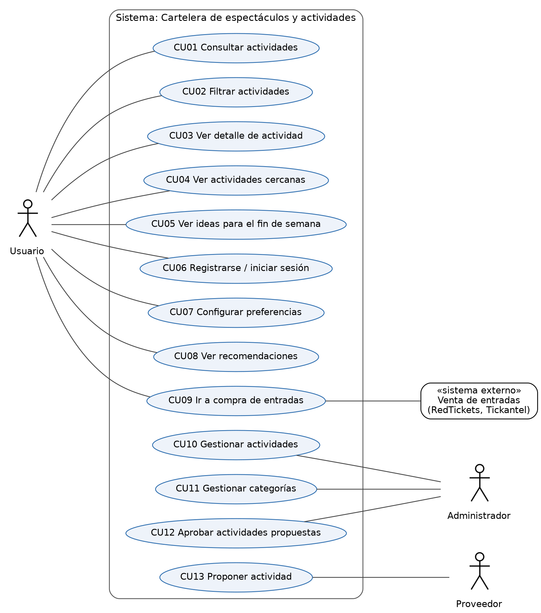

*Figura 1. Diagrama de casos de uso.*

Los actores son el Usuario (actor principal), el Administrador (mantiene el catálogo), el Proveedor (propone actividades) y el sistema externo de venta de entradas (actor secundario). Desde el detalle de una actividad (CU03) el usuario puede ir a la compra de entradas (CU09) si la actividad tiene venta. Las recomendaciones (CU08) usan las preferencias configuradas en CU07.

### 6.2. Descripción de casos de uso

Se describen los casos de uso de consulta y filtrado, que son el núcleo de la aplicación, y el de compra de entradas, que involucra a un actor externo. CU04 y CU10 se describen en el Anexo F.

#### CU01 — Consultar actividades

|  |  |
|---|---|
| **Actor** | Usuario |
| **Precondición** | Hay al menos una actividad vigente cargada. |
| **Flujo principal** | 1. El usuario ingresa a la cartelera.<br>2. El sistema muestra las actividades vigentes ordenadas por fecha, con nombre, fecha, lugar y precio.<br>3. El usuario selecciona una actividad.<br>4. El sistema muestra el detalle (CU03). |
| **Flujo alternativo** | 2a. No hay actividades vigentes: el sistema muestra un mensaje y sugiere ver actividades permanentes. |
| **Postcondición** | El usuario ve la información de la actividad elegida. |
| **Requerimientos** | RF01, RF02 |

#### CU02 — Filtrar actividades

|  |  |
|---|---|
| **Actor** | Usuario |
| **Precondición** | El usuario está en el listado de actividades. |
| **Flujo principal** | 1. El usuario abre los filtros.<br>2. El sistema muestra los filtros de categoría, rango de precio, fecha y horario.<br>3. El usuario selecciona uno o más valores y confirma.<br>4. El sistema muestra solo las actividades que cumplen todos los filtros e indica cuántos filtros están activos. |
| **Flujos alternativos** | 3a. El usuario limpia los filtros: el sistema vuelve a mostrar el listado completo.<br>4a. Ninguna actividad cumple los filtros: el sistema muestra "No encontramos actividades con estos filtros" y ofrece quitarlos. |
| **Postcondición** | El usuario ve el listado filtrado. |
| **Requerimientos** | RF03 |

#### CU09 — Ir a compra de entradas

|  |  |
|---|---|
| **Actores** | Principal: Usuario. Secundario: sistema externo de venta de entradas (RedTickets, Tickantel). |
| **Precondición** | El usuario está en el detalle de una actividad que tiene enlace de venta. |
| **Flujo principal** | 1. El usuario selecciona "Comprar entradas".<br>2. El sistema informa que la compra se realiza en el sitio de la ticketera.<br>3. El usuario confirma.<br>4. El sistema abre el enlace de la actividad en el sitio de venta.<br>5. La compra continúa en el sistema externo, fuera de la aplicación. |
| **Flujos alternativos** | 1a. La actividad no tiene enlace de venta: el botón no se muestra; si es gratuita se indica "Entrada libre".<br>4a. El sitio de venta no responde: el sistema muestra un mensaje y ofrece las redes oficiales de la actividad. |
| **Postcondición** | El usuario queda en el sitio de la ticketera. La aplicación no registra la compra. |
| **Requerimientos** | RF12 |

## 7. Modelo de dominio

### 7.1. Conceptos principales

Los conceptos principales son Usuario, Administrador, Proveedor, Actividad (que puede ser un Evento o una ActividadPermanente), Función, Categoría, Lugar y Valoración. Se definen en la sección 7.3.

### 7.2. Modelo UML / MER

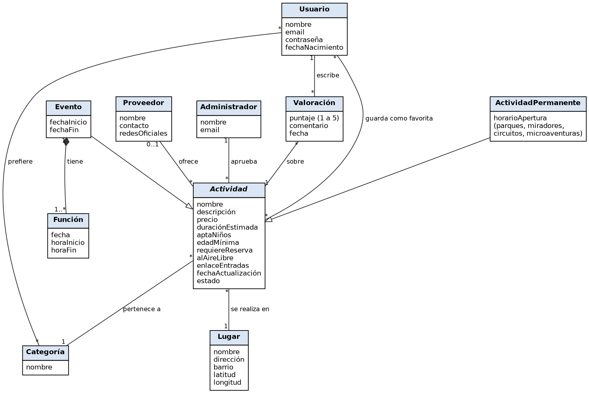

*Figura 2. Modelo de dominio (diagrama de clases conceptual UML).*

Actividad es abstracta: puede ser un Evento, con una o más funciones (fecha y horario), o una ActividadPermanente, como un parque, un mirador o una microaventura. Las preferencias del usuario se modelan como la asociación "prefiere" con Categoría; las recomendaciones se calculan a partir de ellas, por lo que no son un concepto propio.

### 7.3. Definición de conceptos

| **Concepto**            | **Descripción**                                                                                                                               |
|-------------------------|-----------------------------------------------------------------------------------------------------------------------------------------------|
| **Usuario**             | Persona mayor de 18 años que usa la aplicación para buscar actividades. Si se registra, puede guardar preferencias, favoritos y valoraciones. |
| **Administrador**       | Integrante del equipo con permisos para gestionar actividades y categorías y aprobar las propuestas de proveedores.                           |
| **Proveedor**           | Empresa, emprendimiento u organizador que propone actividades para publicar.                                                                  |
| **Actividad**           | Propuesta para el tiempo libre que se muestra en la cartelera. Es un Evento o una ActividadPermanente.                                        |
| **Evento**              | Actividad con fecha, como un concierto, una obra de teatro o una feria.                                                                       |
| **Función**             | Cada fecha y horario en que se realiza un evento.                                                                                             |
| **ActividadPermanente** | Actividad disponible sin fecha, como un parque, un mirador, un circuito o una microaventura.                                                  |
| **Categoría**           | Clasificación de una actividad: música, cine, gastronomía, aire libre, etc.                                                                   |
| **Lugar**               | Sitio donde se realiza la actividad, con dirección y coordenadas para calcular la distancia.                                                  |
| **Valoración**          | Puntaje de 1 a 5 y comentario que un usuario deja sobre una actividad.                                                                        |
| **Preferencia**         | Categoría que el usuario marca como de su interés; se usa para recomendar.                                                                    |
| **Recomendación**       | Actividad sugerida según las preferencias del usuario. Se calcula; no se almacena.                                                            |

## 8. Verificación y Validación

**Verificación:** comprobar que los requerimientos están bien especificados, es decir, que son claros, no ambiguos, verificables, consistentes entre sí, trazables a su origen y priorizados. Responde a la pregunta "¿estamos especificando bien los requerimientos?".

**Validación:** comprobar con los usuarios que los requerimientos reflejan lo que realmente necesitan. Responde a la pregunta "¿estamos especificando los requerimientos correctos?".

### 8.1. Criterios de verificación

Revisamos cada requerimiento con cuatro criterios: claro (se entiende de una sola forma), verificable (se puede comprobar con una prueba o una medida), consistente (no contradice a otro requerimiento) y trazable (tiene un origen identificado). La tabla muestra los requerimientos que no cumplían algún criterio en su versión anterior y la corrección aplicada.

| **ID** | **Resultado**        | **Corrección aplicada**                                                               |
|--------|----------------------|---------------------------------------------------------------------------------------|
| RF01   | Aprobado con cambios | Antes "consultar actividades disponibles": se agregó "vigentes" y el orden por fecha. |
| RF02   | Aprobado con cambios | Unifica el RF03 anterior ("consultar horario, lugar y costo") en el detalle.          |
| RF03   | Aprobado con cambios | Antes solo por categoría; se amplió según P9.                                         |
| RF05   | Aprobado con cambios | Se definió "fin de semana" como el próximo sábado y domingo.                          |
| RF09   | Aprobado con cambios | Antes "configurar preferencias": se especificó que son categorías.                    |
| RF10   | Aprobado con cambios | Se definió el criterio de recomendación (categorías de interés).                      |
| RF17   | Aprobado con cambios | Se detalló qué datos muestra la sección.                                              |
| RNF01  | Aprobado con cambios | Antes "responsive": se agregó el rango de pantallas para poder medirlo.               |
| RNF02  | Aprobado con cambios | Antes "criterios de accesibilidad": se fijó WCAG 2.1 AA.                              |
| RNF03  | Aprobado con cambios | Antes sin valor: se fijaron 2 s y 500 actividades.                                    |
| RNF04  | Aprobado con cambios | Reemplaza "Fiabilidad (disponibilidad)", que no tenía un valor medible.               |
| RNF05  | Aprobado con cambios | Antes "protección de datos (usuario/contraseña)": se especificó el mecanismo.         |
| RNF07  | Aprobado con cambios | Se verifica con la prueba de usabilidad de la sección 8.2.                            |

Los 15 requerimientos restantes (RF04, RF06 a RF08, RF11 a RF16, RF18 a RF20, RNF06 y RNF08) cumplieron los cuatro criterios sin cambios.

### 8.2. Validación con usuarios

La validación consiste en mostrar a usuarios reales lo que especificamos y registrar su feedback. Planificamos las siguientes actividades:

| **Actividad**          | **Participantes**                | **Técnica**                                        | **Qué se valida**                              | **Estado** |
|------------------------|----------------------------------|----------------------------------------------------|------------------------------------------------|------------|
| Entrevistas (2.2.2)    | 3 personas, una por user persona | Entrevista semiestructurada                        | Hallazgos de la encuesta y prioridad de los RF | Pendiente  |
| Revisión del prototipo | 5 personas del público objetivo  | Recorrido del boceto con tareas (CU01, CU02, CU04) | US01, US04, US05 y RNF07                       | Pendiente  |
| Revisión con docentes  | Docentes del curso               | Revisión de la especificación                      | Alcance y prioridades                          | Pendiente  |

Para cada actividad registraremos la fecha, los participantes, qué se mostró o preguntó, el feedback obtenido y el cambio que produjo en los requerimientos:

| **Feedback obtenido** | **Problema detectado** | **Cambio realizado** | **Requerimiento** |
|-----------------------|------------------------|----------------------|-------------------|
|                       |                        |                      |                   |

## 9. Gestión del repositorio Git

### 9.1. Repositorio

[https://github.com/IngSoft-FIS-2026-2/fis-n4a-de-leon-izquierdo-proyecto-group-8](https://github.com/IngSoft-FIS-2026-2/fis-n4a-de-leon-izquierdo-proyecto-group-8)

### 9.2. Estructura

- docs: Documentación del proyecto

- src: Código fuente de la aplicación

  - domain: Lógica de negocio (con tests)

  - interface: Interfaz de usuario

- package.json: Archivo de configuración de npm

- eslint.config.js: archivo de configuración de ESLint

### 9.3. Estrategia de branches

```
main
│
└── develop
    ├── feature/filtros
    ├── feature/detalle-actividad
    └── feature/...
```

- main → versión estable

- develop → integración del desarrollo

- feature/... → desarrollo de funcionalidades

Cada funcionalidad se desarrolla en una rama feature/ creada desde develop y se integra mediante un pull request revisado por otro integrante. develop se integra a main solo al cerrar cada entrega.

### 9.4. Convención de commits

Usamos **Conventional Commits**: cada mensaje tiene el formato tipo(alcance opcional): descripción, con la descripción en presente e imperativo. Tipos: feat (nueva funcionalidad), fix (corrección), docs (documentación), test (pruebas), refactor (cambio de código que no altera el comportamiento) y chore (configuración y mantenimiento). Ejemplos:

```
feat: agrega filtro por categoría
fix: corrige validación del formulario
docs: actualiza README
test: agrega pruebas para búsqueda
```

### 9.5. README

El README incluye la descripción del proyecto, los integrantes, cómo ejecutarlo, las tecnologías, la estructura, las convenciones y la estrategia de ramas.

### 9.6. Evidencia

En el Anexo D se incluyen capturas de las ramas, del historial de commits, del README y de un pull request integrado a develop.

## 10. Trabajo individual

Registro de actividades por integrante:

| **Fecha** | **Integrante** | **Actividad**                      | **Horas** |
|-----------|----------------|------------------------------------|-----------|
| 15/09     | Victoria       | Investigación de requisitos        | 1,5       |
| 22/09     | Ale            | Armar Encuesta                     | 2         |
| 23/09     | Mati           | Configuración Git                  | 1         |
| 25/09     | Victoria       | Encuesta cara a cara               | 2         |
| 25/09     | Victoria       | Guionado para Entrevista           | 2         |
| 27/09     | Todos          | Análisis de resultados (encuestas) | 2.5       |
| 27/09     | Todos          | Investigación de Soluciones        | 2.5       |
| 28/09     | Todos          | Redacción de Requisitos            | 1.5       |
| 28/09     | Todos          | Casos de uso                       | 2.5       |
| 29/09     | Todos          | Modelo de dominio                  | 2         |
| 29/09     | Ale            | Guionado para Entrevista           | 1         |
| 29/09     | Mati           | Guionado para Entrevista           | 1         |
| 29/09     | Ale            | Trabajo en documentación Informe 1 | 2         |
| 29/09     | Mati           | Trabajo en documentación Informe 1 | 2         |
| 29/09     | Victoria       | Trabajo en documentación Informe 1 | 2         |

Total de horas por integrante:

| **Integrante**       | **Total horas** |
|----------------------|-----------------|
| Ale                  | 16              |
| Mati                 | 15              |
| Victoria             | 18.5            |
| **Total del equipo** | 49.5            |

## 11. Reflexión del equipo

### 11.1. Dinámica del equipo

Hicimos reuniones para marcar y dividir tareas.  
Trabajamos de forma independiente en dichas tareas y nos reunimos para comentar y completar los trabajos individuales.

### 11.2. Distribución de tareas

Si bien distribuimos tareas, todos nos ocupamos de todas las tareas, ya sea desde el comienzo, o aportando y modificando las individualidades.

### 11.3. Dificultades

- **Coordinar horarios:** lo resolvimos dividiendo tareas y revisando el trabajo de los demás de forma asíncrona.

- **Acordar las funcionalidades:** cada uno imaginaba una aplicación distinta; la encuesta nos dio un criterio objetivo para priorizar.

- **Aprender Git:** tuvimos que acordar reglas de ramas y commits para no pisarnos el trabajo.

- **Transformar necesidades en requisitos:** pasar de "quiero encontrar cosas cerca" a un requisito verificable costó más de lo esperado.

- **Realizar entrevistas:** coordinarlas lleva más tiempo que difundir una encuesta online.

### 11.4. Lecciones aprendidas

- **Trabajo en equipo:** revisar el trabajo de otro integrante mejora la calidad del resultado.

- **Git y GitHub:** las ramas por funcionalidad y los commits estandarizados facilitan seguir el historial.

- **Requisitos:** todo requisito necesita un criterio medible para poder verificarse.

- **Validación:** las encuestas en persona nos permitieron detectar preguntas confusas antes de difundir el formulario.

- **Planificación:** ordenar las técnicas (encuesta, entrevistas, prototipo) hace que cada una alimente a la siguiente.

### 11.5. Qué mejoraríamos

- Hacer las entrevistas antes de cerrar la lista de requerimientos.

- Probar el formulario antes de difundirlo: la P16 se interpretó como de sí o no y la P7 permitió elegir más de 3 opciones.

- Preguntar el lugar de residencia, para saber si los resultados representan a Montevideo o a todo el país.

- Registrar las horas el mismo día, para que el registro individual quede completo.

## 12. Conclusiones

Abordamos un problema que la encuesta confirmó: el 92% tiene dificultades para encontrar qué hacer en su tiempo libre, sobre todo por la información dispersa, no saber qué hay cerca o no tener un plan. La encuesta a 98 personas y el análisis de seis soluciones existentes mostraron que los usuarios necesitan ubicación, horario y precio para decidir, valoran combinar filtros y aceptan recomendaciones opcionales. También identificamos a HayPlan! como competidor directo, por lo que enfocamos la propuesta en quien planifica el fin de semana, en especial con niños, y en la confiabilidad de la información.

Especificamos 20 requerimientos funcionales y 8 no funcionales, priorizados y trazables, 9 user stories con criterios de aceptación, los casos de uso principales y el modelo de dominio. Los requerimientos fueron verificados y la validación con usuarios queda planificada. Para el Informe 2 queda definido el alcance: los seis requerimientos funcionales de prioridad alta.

## 13. Anexos

Los anexos complementan el cuerpo del informe y no forman parte del límite de páginas:

- Anexo A. Cuestionario de la encuesta

- Anexo B. Análisis completo de la encuesta

- Anexo C. Guion de entrevistas

- Anexo D. Evidencia del repositorio

- Anexo E. Evidencia de validación

- Anexo F. Casos de uso adicionales

### Anexo A. Cuestionario de la encuesta

Formulario anónimo en Google Forms, con un tiempo estimado de 3 a 5 minutos. Texto de presentación: "Estamos desarrollando una aplicación que busca facilitar la búsqueda de espectáculos y actividades para realizar en el tiempo libre. La encuesta es anónima y tiene como objetivo conocer hábitos, preferencias y necesidades de las personas al momento de buscar qué hacer."

**1. ¿En qué rango de edad te encontrás?** Opciones: Menos de 18 años; 18 a 25 años; 26 a 35 años; 36 a 45 años; 46 a 55 años; Más de 55 años.

**2. ¿Con qué frecuencia buscás actividades o espectáculos para hacer en tu tiempo libre?** Opciones: Varias veces por semana; Una vez por semana; Algunas veces al mes; Algunas veces al año; Casi nunca.

**3. ¿Qué tipo de actividades te interesan? (selección múltiple)** Opciones: Cine; Teatro; Música / conciertos; Museos / exposiciones; Ferias; Actividades deportivas; Actividades al aire libre; Gastronomía; Actividades culturales; Actividades para hacer con niños; Actividades gratuitas; Microaventuras / paseos; Bailes; Otro.

**4. Cuando buscás una actividad, ¿para qué momento generalmente la buscás?** Opciones: Para hacer hoy; Para mañana; Para el fin de semana; Para una fecha específica; No tengo una fecha definida, busco ideas.

**5. ¿Con quién realizás habitualmente estas actividades?** Opciones: Solo/a; Pareja; Amigos; Familia; Con niños; Depende de la actividad.

**6. ¿Qué información considerás importante conocer antes de decidirte por una actividad? (selección múltiple)** Opciones: Precio; Día y horario; Ubicación; Duración; Tipo/categoría; Edad recomendada; Si requiere reserva; Disponibilidad de entradas/cupos; Información sobre accesibilidad; Opiniones o valoraciones de otros usuarios; Fotografías; Otra.

**7. ¿Qué factores suelen determinar tu decisión final? (hasta 3)** Opciones: Precio; Cercanía; Horario; Tipo de actividad; Opiniones/recomendaciones; Duración; Que sea gratuita; Que sea apta para niños; Que pueda reservarse fácilmente; Otro.

**8. ¿Te resulta útil poder filtrar actividades?** Opciones: Sí, mucho; Sí, algo; Me resulta indiferente; No.

**9. Si pudieras aplicar filtros, ¿cuáles utilizarías? (selección múltiple)** Opciones: Categoría; Fecha; Horario; Precio; Ubicación/distancia; Actividades gratuitas; Actividades para niños; Actividades al aire libre; Duración; Otro.

**10. ¿Alguna vez buscaste "qué hacer" sin tener una actividad específica en mente?** Opciones: Sí, frecuentemente; Sí, algunas veces; Muy pocas veces; Nunca.

**11. ¿Te interesaría recibir sugerencias según tus preferencias?** Opciones: Sí; Tal vez; No.

**12. ¿Cuál de estas propuestas te interesaría encontrar? (selección múltiple)** Opciones: Caminatas; Paseos por la ciudad; Visita a museos; Lugares históricos; Miradores / lugares para conocer; Parques y espacios verdes; Circuitos o recorridos; Actividades gratuitas; Actividades para hacer en poco tiempo; Otra.

**13. Si tuvieras una sección de "¿Qué puedo hacer ahora?", ¿qué información te gustaría que tuviera? (selección múltiple)** Opciones: Distancia desde donde estoy; Tiempo estimado de la actividad; Costo; Horario; Cómo llegar; Si puedo realizarla sin reserva; Si es apta para niños; Si es al aire libre; Otra.

**14. Cuando buscás actividades para hacer, ¿qué dificultades encontrás? (selección múltiple)** Opciones: La información está dispersa en distintos sitios; Es difícil encontrar actividades según mis gustos; No encuentro fácilmente los precios; No encuentro fácilmente horarios; No sé qué actividades hay cerca; No sé qué hacer cuando no tengo un plan definido; La información está desactualizada; Hay demasiadas opciones y me cuesta elegir; No suelo encontrar actividades gratuitas; No tengo dificultades; Otra.

**15. ¿Dónde buscás actualmente este tipo de información? (selección múltiple)** Opciones: Google / buscador web; Instagram; Facebook; TikTok; Sitios web específicos; Aplicaciones; Recomendaciones de amigos/familia; Carteleras físicas; Otro.

**16. Si existiera una aplicación que reuniera en un solo lugar espectáculos y actividades, ¿qué funcionalidad te resultaría más útil?** *Respuesta abierta.*

**17. ¿Hay alguna otra función que te gustaría que tuviera una aplicación de este tipo?** *Respuesta abierta.*

### Anexo B. Análisis completo de la encuesta

#### B.1. Ficha técnica

|                   |                                                                                                                                                                                                                                           |
|-------------------|-------------------------------------------------------------------------------------------------------------------------------------------------------------------------------------------------------------------------------------------|
| **Instrumento**   | Formulario en línea (Google Forms), anónimo, de 17 preguntas: 1 demográfica, 6 de opción única, 8 de selección múltiple y 2 abiertas.                                                                                                     |
| **Período**       | Del 25 al 29 de setiembre de 2026. Las primeras 10 encuestas se hicieron cara a cara y se registraron en el mismo formulario.                                                                                                             |
| **Respuestas**    | 98 (incluye las 10 presenciales), todas completas en las preguntas obligatorias.                                                                                                                                                          |
| **Procesamiento** | Exportación a CSV; separación de las respuestas de selección múltiple y conteo por opción; porcentajes siempre sobre 98 (en selección múltiple no suman 100%); cruces por rango de edad; codificación temática de las preguntas abiertas. |

#### B.2. Perfil de los encuestados (P1, P2 y P5)

| **Rango de edad** | **Respuestas** | **%** |
|-------------------|----------------|-------|
| Menos de 18 años  | 6              | 6,1%  |
| 18 a 25 años      | 16             | 16,3% |
| 26 a 35 años      | 17             | 17,3% |
| 36 a 45 años      | 30             | 30,6% |
| 46 a 55 años      | 22             | 22,4% |
| Más de 55 años    | 7              | 7,1%  |

El grupo más numeroso es el de 36 a 45 años. Si bien encuestamos a personas de distintas edades, nuestro público objetivo son los mayores de 18 años; las 6 respuestas de menores se mantuvieron en el análisis porque no cambian las tendencias.

| **Frecuencia de búsqueda** | **Respuestas** | **%** |
|----------------------------|----------------|-------|
| Varias veces por semana    | 7              | 7,1%  |
| Una vez por semana         | 22             | 22,4% |
| Algunas veces al mes       | 49             | 50,0% |
| Algunas veces al año       | 17             | 17,3% |
| Casi nunca                 | 3              | 3,1%  |

La búsqueda no es diaria, pero el 80% busca al menos algunas veces al mes. Buscar actividades no solo muestra ganas de salir, sino también una necesidad de información. Como la aplicación se usaría con poca frecuencia, existe el riesgo de que el usuario la desinstale por falta de uso; es una suposición que validaremos en las entrevistas.

| **Con quién realiza las actividades** | **Respuestas** | **%** |
|---------------------------------------|----------------|-------|
| Depende de la actividad               | 33             | 33,7% |
| Familia                               | 24             | 24,5% |
| Pareja                                | 17             | 17,3% |
| Amigos                                | 16             | 16,3% |
| Solo/a                                | 6              | 6,1%  |
| Con niños                             | 2              | 2,0%  |

Un tercio responde "depende de la actividad": la misma persona planifica para distintos grupos. Por eso no conviene categorizar las actividades según con quién se hacen, pero sí ofrecer el filtro "aptas para niños", ya que el 32% se interesa por actividades con niños (P3).

#### B.3. Intereses y momento de búsqueda (P3, P4 y P10)

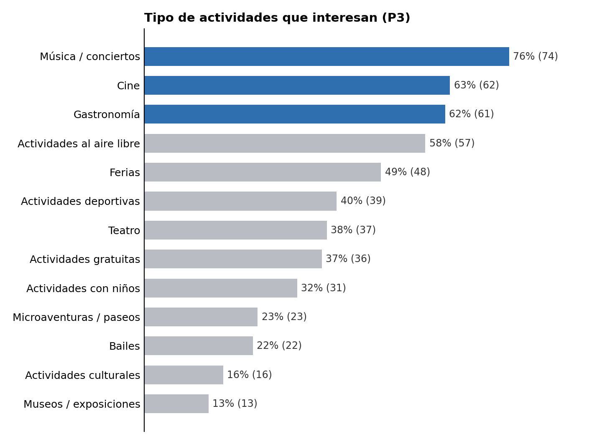

Hay un fuerte interés por la música, el cine, la gastronomía y el aire libre, que serán las categorías destacadas. No hay que dejar de lado el resto: el 32% que busca actividades con niños parece poco, pero sube al 70% en el grupo de 36 a 45 años, que probablemente concentra a quienes tienen hijos chicos.

| **Para qué momento busca (P4)**      | **Respuestas** | **%** |
|--------------------------------------|----------------|-------|
| Para el fin de semana                | 47             | 48,0% |
| No tengo fecha definida, busco ideas | 35             | 35,7% |
| Para una fecha específica            | 10             | 10,2% |
| Para hacer hoy                       | 6              | 6,1%  |

La mayoría busca para el fin de semana o sin fecha, buscando ideas; ninguna persona eligió "para mañana". Además, el 72% buscó alguna vez "qué hacer" sin una actividad en mente (P10: 26 frecuentemente y 45 algunas veces). Esto respalda una sección de ideas para el fin de semana (RF05).

#### B.4. Información necesaria y decisión (P6 y P7)

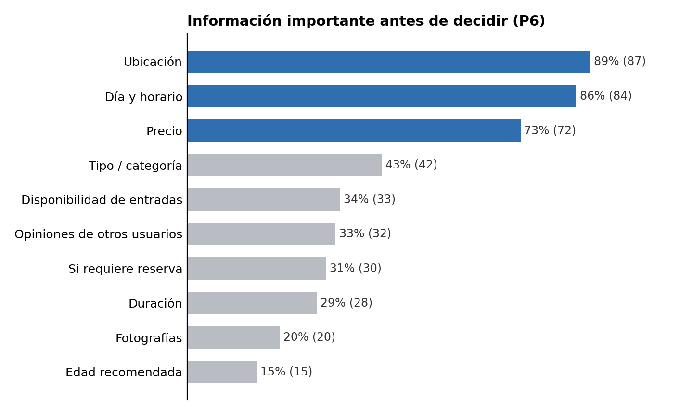

Ubicación, día y horario, y precio son imprescindibles. La accesibilidad fue mencionada por una sola persona, aunque sigue siendo un requisito del curso (RNF02).

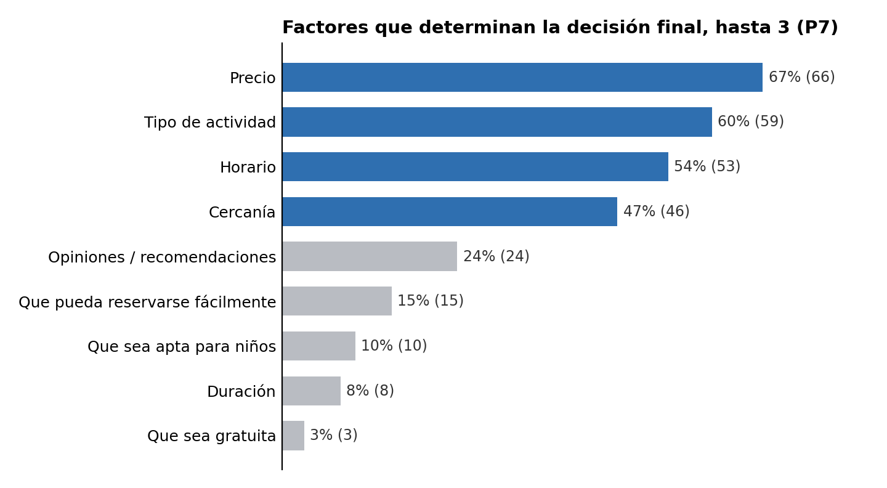

La gratuidad decide solo en el 3% de los casos, aunque el 37% se interesa por actividades gratuitas: el precio importa como dato para comparar más que como condición excluyente. Nota: el formulario no limitó la cantidad de opciones y 9 personas eligieron entre 4 y 6 factores; se incluyeron en el conteo.

#### B.5. Filtros, sugerencias y propuestas (P8, P9, P11, P12 y P13)

Al 89% le resulta útil filtrar actividades (53% "sí, mucho" y 36% "sí, algo"); solo una persona respondió que no.

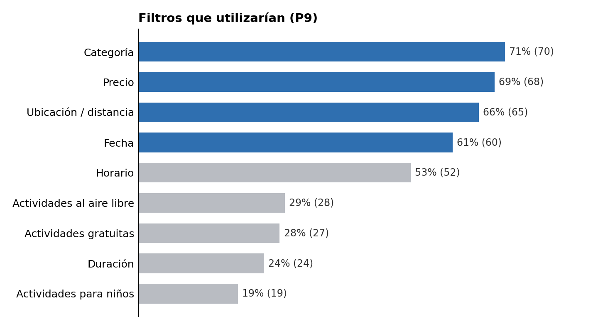

Cada persona eligió en promedio 4,2 filtros, por lo que deben poder combinarse.

| **Recibir sugerencias (P11)** | **Sí**   | **Tal vez** | **No**   |
|-------------------------------|----------|-------------|----------|
| **Menores de 26 (22)**        | 11       | 11          | 0        |
| **26 a 45 (47)**              | 28       | 12          | 7        |
| **Mayores de 45 (29)**        | 11       | 11          | 7        |
| **Total (98)**                | 50 (51%) | 34 (35%)    | 14 (14%) |

Las sugerencias tienen buena aceptación, sobre todo entre los más jóvenes; entre los mayores de 45 aumentan las dudas. Por eso las recomendaciones deben poder desactivarse (RF10).

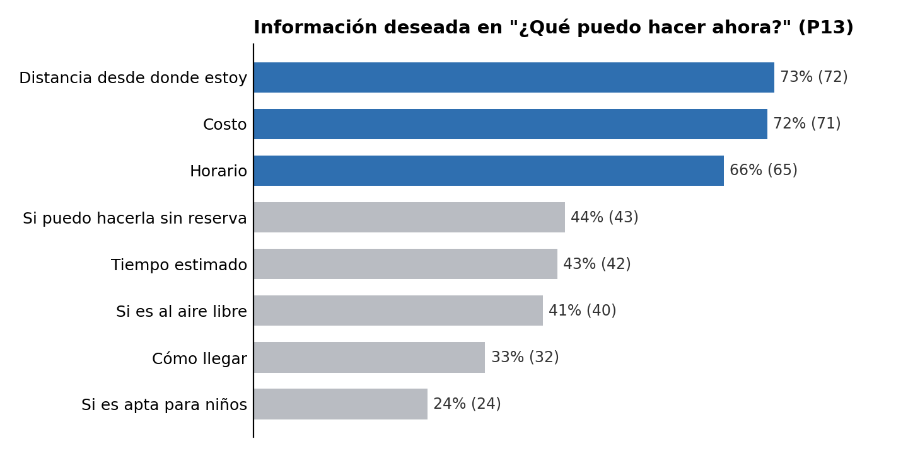

Esta pregunta reafirma lo relevado en P6 y P7: distancia, costo y horario. Sin embargo, como solo el 6% busca para el mismo día, la sección "¿Qué puedo hacer ahora?" tiene prioridad baja (RF17).

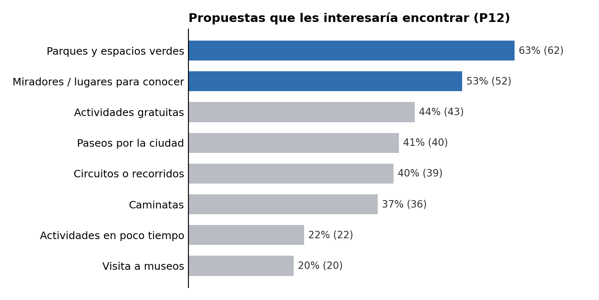

Las propuestas preferidas son lugares permanentes, no eventos con fecha; por eso el modelo de dominio distingue entre Evento y ActividadPermanente.

#### B.6. Dificultades y fuentes de información (P14 y P15)

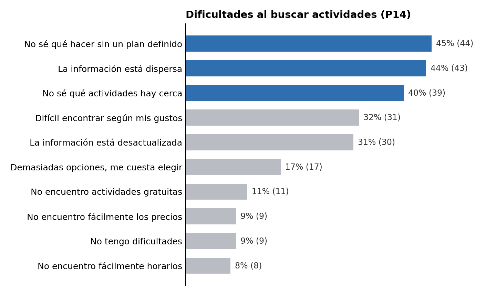

90 de 98 personas (92%) marcan al menos una dificultad, con un promedio de 2,5 por persona. Las tres principales se corresponden con funcionalidades concretas: ideas y recomendaciones, centralización de la oferta y búsqueda por cercanía. Una persona marcó "No tengo dificultades" junto con otra dificultad.

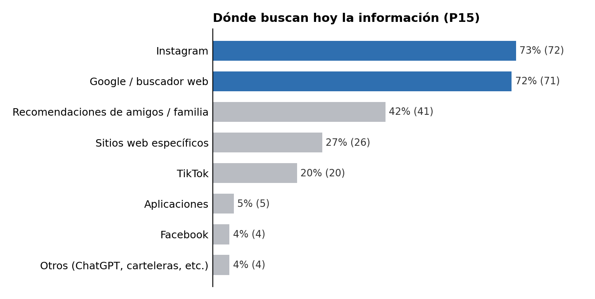

| **Fuente**    | **Menores de 26 (22)** | **26 a 45 (47)** | **Mayores de 45 (29)** |
|---------------|------------------------|------------------|------------------------|
| **TikTok**    | 68%                    | 9%               | 3%                     |
| **Instagram** | 68%                    | 81%              | 66%                    |
| **Google**    | 59%                    | 74%              | 79%                    |

Los encuestados ya buscan en Instagram y Google, por lo que es útil incluir en cada actividad el enlace a su sitio y a sus redes oficiales (RF12). TikTok es relevante casi solo para los menores de 26 años.

#### B.7. Segmentos por edad

| **Segmento**      | **Tamaño** | **Rasgos que lo distinguen**                                                                                     | **Necesidad principal**                                    |
|-------------------|------------|------------------------------------------------------------------------------------------------------------------|------------------------------------------------------------|
| **Menores de 26** | 22 (22%)   | TikTok 68%; gastronomía 77%; 55% no sabe qué hacer sin un plan; nadie rechaza las sugerencias.                   | Descubrir ideas para salir con amigos o pareja.            |
| **26 a 45 años**  | 47 (48%)   | Actividades con niños 51%; 53% no sabe qué hay cerca; 51% sufre la información dispersa; 60% quiere sugerencias. | Encontrar rápido algo cercano y apto para toda la familia. |
| **Mayores de 45** | 29 (30%)   | Google 79%; teatro 55%; 41% sale en familia; 55% busca ideas sin fecha; 24% rechaza las sugerencias.             | Información clara, completa y confiable.                   |

#### B.8. Respuestas abiertas (P16 y P17)

Cada respuesta se asignó a una o más categorías. En P16, 80 de 98 respuestas tienen contenido codificable; las demás son del tipo "Sí" o "Ni idea", lo que indica que algunas personas interpretaron la pregunta como de sí o no. En P17, 46 personas propusieron al menos una función.

| **P16. Funcionalidad más útil**           | **Menciones** | **Ejemplo textual**                                                           |
|-------------------------------------------|---------------|-------------------------------------------------------------------------------|
| Filtros y búsqueda combinada              | 23            | "Que pueda utilizar varios filtros a la vez según la preferencia del momento" |
| Todo centralizado en un solo lugar        | 12            | "Que esté todo en un único sitio"                                             |
| Mapa, ubicación y cercanía                | 11            | "Mapa interactivo para ver qué eventos hay cerca de mi ubicación"             |
| Información clara del evento              | 9             | "Mostrar horario, fecha, precio y ubicación"                                  |
| Recomendaciones según gustos              | 9             | "Recibir recomendaciones según mis intereses"                                 |
| Público y compañía (niños, edades, grupo) | 6             | "Que especificara el rango de edad de los niños"                              |
| Búsqueda por fecha o día                  | 5             | "Qué actividades hay para una fecha determinada"                              |
| Compra o reserva de entradas              | 3             | "Reserva y comprar entradas por la aplicación"                                |
| Agenda, calendario y clima                | 3             | "Sincronizar con el calendario del correo"                                    |
| Notificaciones y avisos                   | 2             | "Dar aviso de actividades cerca de mi zona"                                   |

| **P17. Otras funciones deseadas**          | **Menciones** | **Ejemplo textual**                                                         |
|--------------------------------------------|---------------|-----------------------------------------------------------------------------|
| Notificaciones, recordatorios y alertas    | 11            | "Alarma al momento de salir a la venta entradas"                            |
| Reseñas, opiniones y fotos                 | 8             | "Que la gente que está ahí pueda dar su opinión en tiempo real"             |
| Compra de entradas y pagos integrados      | 6             | "Poder comprar las entradas desde la app"                                   |
| Comunidad y conexión con otras personas    | 4             | "Conectar con personas que quieren asistir a lo mismo"                      |
| Descuentos, ofertas y cupones              | 4             | "Que incluya descuentos disponibles con tarjetas"                           |
| Información confiable y actualizada        | 4             | "Que la información sea certera"                                            |
| Recomendaciones (incluso fuera del perfil) | 3             | "Recomendaciones que quizás me gusten pero no 100% alineadas con mi perfil" |
| Mapa y cercanía                            | 3             | "Marcar actividades por cercanía"                                           |
| Itinerarios y agenda                       | 3             | "Creador de itinerarios"                                                    |
| Enlaces al sitio o redes del evento        | 2             | "Redirección a página del evento"                                           |
| Accesibilidad                              | 2             | "Saber si algo es accesible para silla de ruedas"                           |

#### B.9. Limitaciones

- Muestra por conveniencia: no es representativa de la población. El rango de 36 a 55 años está sobrerrepresentado (53%) y hay solo 7 mayores de 55.

- No se preguntó el lugar de residencia, por lo que no sabemos si los resultados reflejan solo a Montevideo.

- El formulario no controló la consigna de la pregunta 7 (hasta 3 opciones).

- La codificación de las respuestas abiertas es interpretativa; para reducir el sesgo conviene que dos integrantes codifiquen por separado y comparen.

- La encuesta mide lo que las personas dicen que harían, no su comportamiento real; por eso se complementa con entrevistas y validación con prototipo.

### Anexo C. Guion de entrevistas

Entrevista semiestructurada de 20 a 30 minutos. Al inicio se explica el objetivo y se pide permiso para tomar notas.

1\. Contame cómo fue la última vez que buscaste algo para hacer en tu tiempo libre. ¿Dónde buscaste y cómo decidiste?

2\. ¿Qué información te faltó o te costó encontrar?

3\. Si tuvieras una aplicación para esto, ¿cada cuánto creés que la usarías? ¿La desinstalarías si no la usás seguido? ¿Qué haría que la uses con más frecuencia?

4\. ¿Cómo preferís ver la ubicación de una actividad: un mapa dentro de la aplicación, un enlace a Google Maps o solo la dirección?

5\. Las fotos no fueron decisivas en la encuesta. ¿Te ayudan a decidir o solo te llaman la atención?

6\. ¿Qué datos tuyos estarías dispuesto a dar para recibir sugerencias adecuadas?

7\. ¿Te gustaría poder cambiar tus preferencias cuando quieras?

8\. ¿Te resultaría útil una sección de "¿Qué puedo hacer ahora?"? ¿En qué situación la usarías?

9\. ¿Te gustaría recibir notificaciones? ¿De qué tipo y con qué frecuencia?

10\. ¿Qué te haría confiar en que la información de una actividad está actualizada?

11\. ¿Conocés HayPlan! u otra aplicación parecida? ¿Qué te gusta y qué no?

12\. Para cerrar: ¿hay algo que no te pregunté y te parece importante?

### Anexo D. Evidencia del repositorio

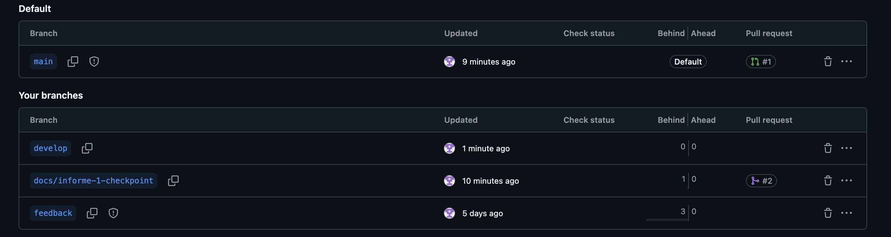

*\[Pendiente: del historial de commits, del README y de un pull request integrado a develop.\]*

### Anexo E. Evidencia de validación

*\[Pendiente: notas de las entrevistas\]*

#### Prototipo inicial

Resumen de las pantallas creadas:

- Cartelera Principal (Home) (Cartelera - Montevideo Vivo):

  - Filtros rápidos temporales: Selector deslizante (Hoy, Este Finde, Esta Semana, Siempre Disponible) y selector rápido por barrio y rango de costo.

  - Contador dinámico de puesta de sol: Widget en la cabecera indicando la hora del atardecer en la Rambla.

  - Destacado de la semana: Banner para espectáculos de alto calibre (ej. Festival de Jazz en Sala Zitarrosa).

  - Feed "Para salir hoy": Jerarquía con horarios, barrios (Barrio Sur, Ciudad Vieja, Punta Carretas) y etiquetas visuales de costo (Gratis en verde suave o precio en terracota).

  - Sección "Siempre disponible": Microaventuras sin horario fijo (Mirador de la Intendencia, circuitos arquitectónicos autoguiados).

- Explorar & Mapa Cultural:

  - Buscador global: Búsqueda por concierto, teatro, feria o parque, con filtros rápidos.

  - Moods montevideanos: Píldoras de ánimo e intenciones (Al atardecer 🌅, Planes tranqui ☕, Con entrada libre 🎟️, Mate y amigos 🧉).

  - Mapa geolocalizado: Vista de la costa y barrios culturales con pines interactivos de teatros y espacios emblemáticos.

  - Feed por cercanía: Propuestas a pasos del usuario (Parque Rodó, Museo Zorrilla, EAC).

- Ficha Detallada del Espectáculo (Detalle: La Tregua - Teatro Solís):

  - Cabecera inmersiva: Fotografía del Teatro Solís, etiquetas de categoría y acciones de compartir y guardar.

  - Grilla de decisión rápida: Fecha y hora, sala/ubicación, rango de entradas (con beneficios de tarjetas) y duración.

  - Llegada & Transporte público: Mapa del punto exacto con líneas de ómnibus frecuentes (104, 180, CA1) y accesos.

  - Combiná tu salida: Recomendaciones gastronómicas y paseos a pie a menos de 400 metros para antes o después de la función.

  - Barra de acción fija: Botón directo para compra de localidades vía Tickantel y recordatorio de agenda.

- Mi Agenda & Guardados:

  - Itinerario personal: Vista cronológica de entradas confirmadas con acceso rápido a e-tickets/QR.

  - "Inspirame hoy": Widget contextual sugerente según clima y hora dorada.

  - Lugares guardados & Wishlist: Colección de planes atemporales para hacer en cualquier momento.

  - Social: Botón para compartir el itinerario del fin de semana por WhatsApp.

- Identidad visual y diseño

  - Paleta: Terracota y ámbar atardecer (#E05A36), azul río de la plata (#1A2B3C), fondos claros y cálidos de arena urbana y tipografía geométrica legible (Plus Jakarta Sans).

  - Consistencia: Componentes unificados mediante el sistema de diseño y marco de navegación compartido.

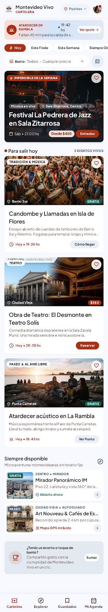

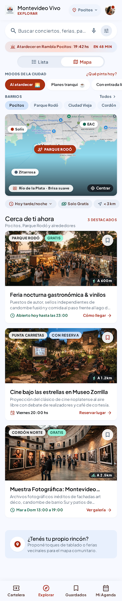

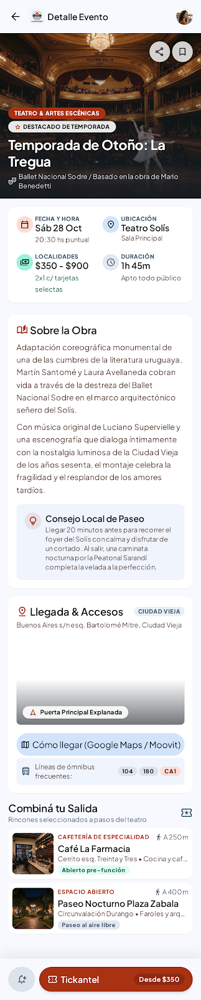

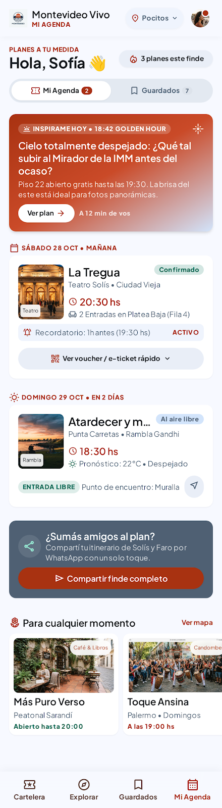


### Anexo F. Casos de uso adicionales

#### CU04 — Ver actividades cercanas

|  |  |
|---|---|
| **Actor** | Usuario |
| **Precondición** | El usuario está en el listado de actividades. |
| **Flujo principal** | 1. El usuario elige "Cerca mío".<br>2. El sistema pide permiso para usar la ubicación.<br>3. El usuario acepta.<br>4. El sistema muestra las actividades ordenadas por distancia, con la distancia en km. |
| **Flujos alternativos** | 3a. El usuario no da permiso: el sistema le pide ingresar un barrio y ordena según ese barrio.<br>4a. No hay actividades a menos de 10 km: el sistema amplía el radio y lo informa. |
| **Postcondición** | El usuario ve las actividades por cercanía. La ubicación no se guarda. |
| **Requerimientos** | RF04, RNF06 |

#### CU10 — Gestionar actividades

|  |  |
|---|---|
| **Actor** | Administrador |
| **Precondición** | El administrador inició sesión. |
| **Flujo principal** | 1. El administrador elige "Nueva actividad".<br>2. El sistema muestra el formulario.<br>3. El administrador completa nombre, categoría, lugar, fecha y horario (o marca la actividad como permanente), precio y los demás datos.<br>4. El administrador guarda.<br>5. El sistema valida los campos obligatorios, registra la fecha de actualización y publica la actividad. |
| **Flujos alternativos** | 1a. Modificar o dar de baja: el administrador selecciona una actividad existente, la edita o la da de baja, y el sistema registra la fecha de actualización.<br>5a. Falta un campo obligatorio: el sistema lo marca y no guarda. |
| **Postcondición** | La actividad queda publicada, actualizada o dada de baja. |
| **Requerimientos** | RF06, RNF04 |
